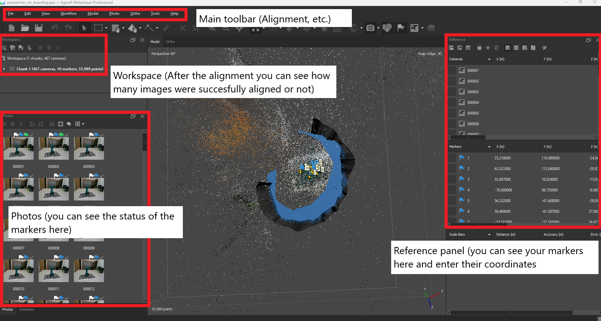
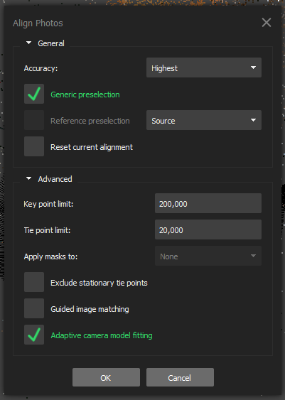
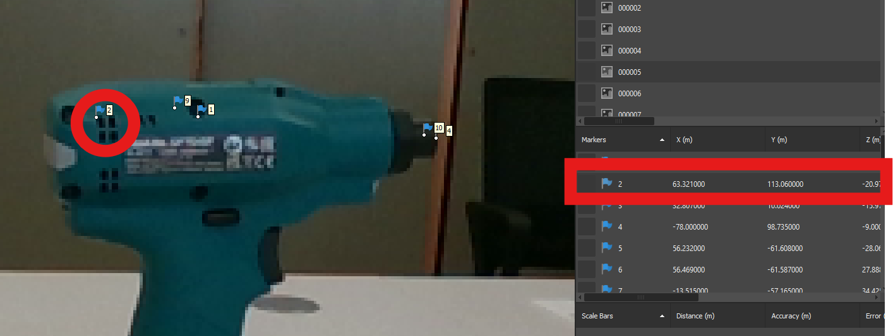
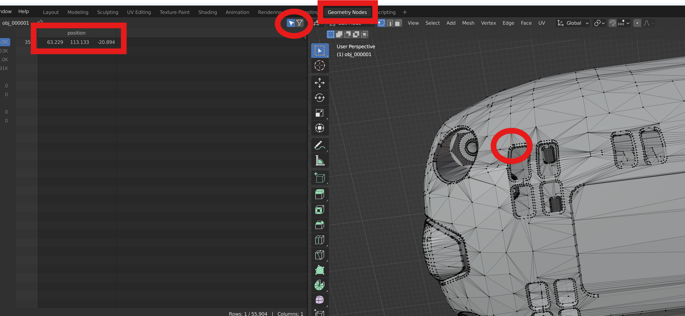
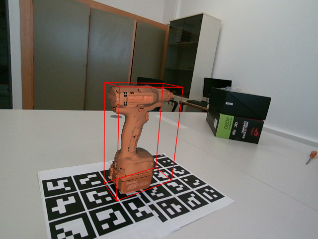
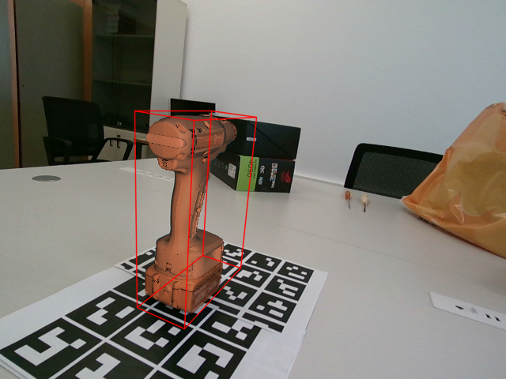
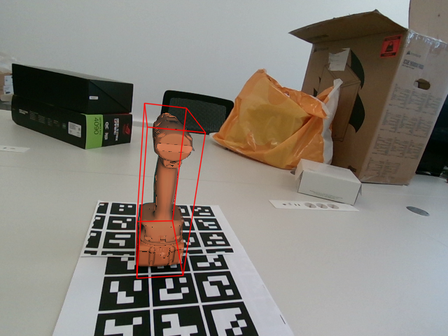
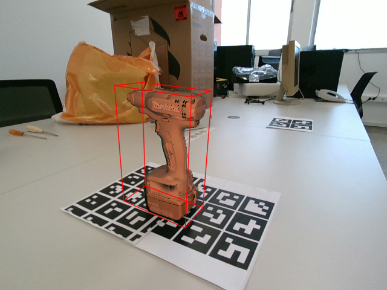
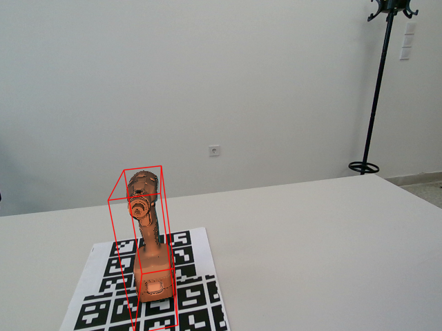

# 🛠️ 6D-Annotation-tools

## 🚀 Installation

1. With submodules (Visualization module):
```bash
git clone --recurse-submodules https://github.com/pansap99/6D-Annotation-tools
conda create -n 6dannot python=3.10 -y
conda activate 6dannot
pip install -r requirements.txt
cd 6DL-PoseGenerator
pip install -r requirements.txt
```

2. Without submodules (No Visualization module):
```bash
git clone https://github.com/pansap99/6D-Annotation-tools
conda create -n 6dannot python=3.10 -y
conda activate 6dannot
pip install -r requirements.txt
```

## 📖 Overview

The **6D-Annotation tool** is based on **Agisoft Metashape** and provides a way to extract **6D poses** from a set of **2D-3D markers**. The process consists of four main steps:

1. **Rename images** starting from `000001`, ..., `{image_num}.zfill(6)`
2. **Load the images** in Agisoft Metashape and run **Structure from Motion (SfM)**
3. **Extract 2D-3D markers**
4. **Compute the 6D poses** using the 2D-3D markers

## 🎨 Getting Familiar with Agisoft Metashape

<p align="center">
  
</p>

## 🛠️ Usage

### 1. 📂 Rename Images

Run:
```bash
python utils/rename_images.py --folder <path_to_image_folder>
```

### 2. 📷 Load Images & Run SfM in Agisoft Metashape

1. **Load the images** in Agisoft Metashape by dragging and dropping into the chunk.
2. Go to `Workflow` -> `Align photos`, enable `Generic preselection`, and set the accuracy to `Highest`. Click the `Advanced` tab and set the `Key point limit` to `200,000` and `Tie point limit` to `20,000`. Then click `OK`.
3. Wait for the alignment to finish.

<p align="center">
  
</p>

### 3. 🖼️ Agisoft Metashape + Blender

1. Open **Blender** while keeping the **Agisoft Metashape** window open.
2. In Blender, drag and drop the **3D model** and open it.
3. In the upper left corner, switch from `Object mode` to `Edit Mode`. Click `Select` and then `None`. Also, go to the `Geometry Nodes` tab in the main toolbar.
4. Spot a suitable keypoint both in the **3D model** and the **2D image**:
   - Click in the image and select `Add marker`, name it starting from `1`.
   - Select the same point in the **3D model** using the Blender picker and fill the coordinates in the `Reference` pane. In the left pane, activate the `Show only selected` option. Now, each time you select a 3D point, its coordinates are shown. These are the coordinates you fill in the `Reference` pane in Metashape.

<p align="center">
  
  
</p>

5. Repeat this process until you have more than **4 markers** in each aligned frame.

**Note:** Metashape will automatically infer the markers' locations in other frames (blue flags), so you don't have to do it in every image. Usually, **5-6 diverge images** suffice. The flags must be **blue** or **green**. If they are **gray**, you have to manually move the marker to make it green.

**Suggestions for accurate poses:**
- Use characteristic points that are visible in the majority of the images if possible.
- Ensure your key-points are not all coplanar and are well-distributed across the object's surface.
- Be as accurate as possible when moving and placing markers. (At least in the images you select to manually annotate. As said before, it is not necessary to do it in every image.)

### 4. 📄 Extract 2D-3D Markers from SfM Results

Export the markers from Metashape by going to `File` -> `Export` -> `Markers`. Save the file as an **XML** file.

### 5. 📊 Compute 6D Poses

Run:
```bash
python run.py \
--marker_file <path_to_markers.xml> \
--camera_calib_file <path_to_camera_calib.txt> \
--results_dir <path_to_results>
```

---

### 6. 🎨 Visualize the 6D Poses (Optional)

This requires to clone the repo including submodules (see Installation).
```bash
cd 6DL-PoseGenerator
python vis_poses.py \
--model-path <path_to_3d_model> \
--poses <path_to_poses.json> \
--images <path_to_images> \
--camera-params <path_to_camera_params.json> \
--outPath <path_to_output>
```

### Example visualizations

<p align="center">
  
  
  
  <br>
  
  
  
</p>
